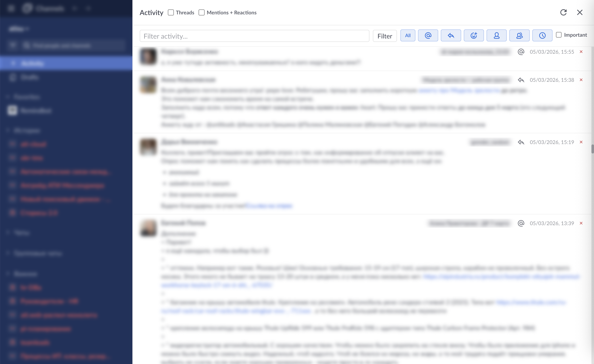
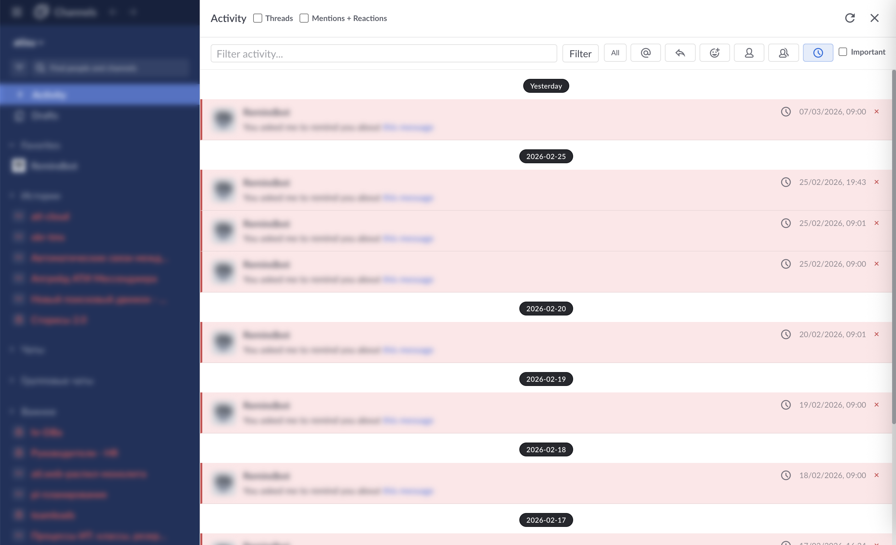
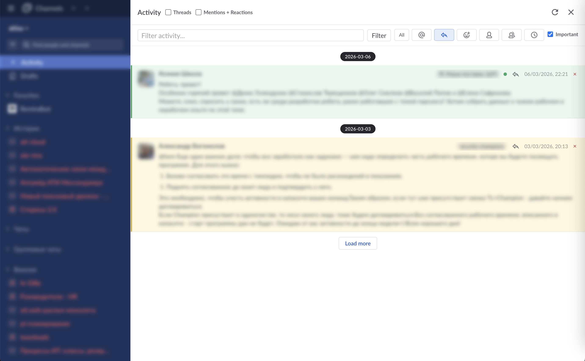

# Mattermost Desktop (fork)

Fork adds **Activity** — a sidebar panel aggregating mentions, threads, reactions, DMs, GMs and reminders in a single feed.[^1]

[^1]: Original readme: [release-5.10 README](https://github.com/mattermost/desktop/blob/release-5.10/README.md). Copy: [README.Original.md](README.Original.md).

## Activity (with demo blur)

**Summary:** Activity is a sidebar panel that aggregates mentions, thread replies, reactions, DMs, GMs and reminders into a single chronological feed. It is opened from the Mattermost webapp sidebar (injected item). Native Threads and Mentions sidebar items can be hidden to avoid duplication.

**Details:**

* **Sources:** Data is fetched from Mattermost API via adapters: mentions (recent_mentions, unread), threads (teams/threads), reactions (post metadata), DMs/GMs (direct channels), reminders (users/me/reminders). Sources can be toggled per kind via env vars (`MM_DESKTOP_ACTIVITY_SOURCE_*`).

* **UI:** Activity item in the webapp sidebar opens an overlay panel. The panel shows a feed with Load more, Refresh, and local search. Items can be filtered by Threads/Mentions. Individual items can be hidden (×). Clicking an item navigates to the post/thread/channel.

* **Demo blur:** Set `MM_DESKTOP_ACTIVITY_DEMO_BLUR=1` to enable a blur overlay on the sidebar and main content (for demo purposes).

* **Implementation:** `externalAPI.ts` injects the Activity item into the webapp sidebar; `ActivitySidebar.tsx` renders the React overlay; `activityAggregationService` merges and deduplicates items; IPC handlers in `activityIntercom.ts` bridge main and renderer.
